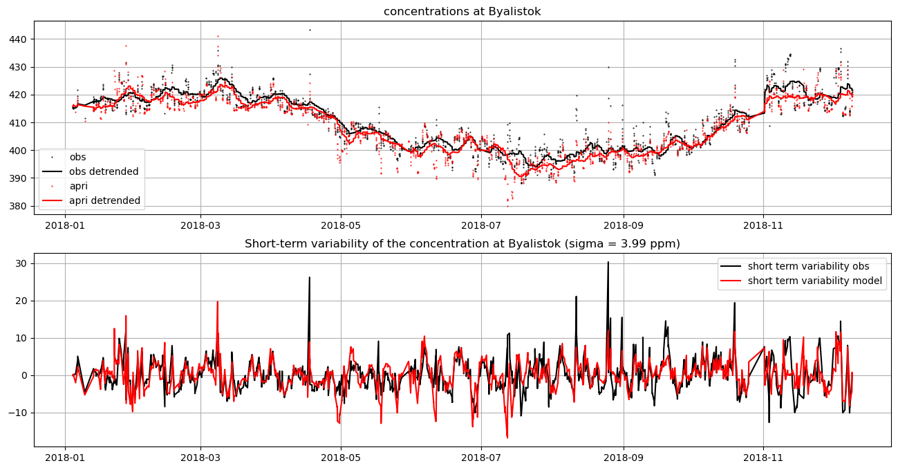

# Step-by-step inversion tutorial 

This tutorial shows how to run a simple CO2 inversion, using example data. This assumes that:
1. LUMIA has been installed
2. The example observation file (obs_example.tgz) and configuration file (inversion.yaml) are present in the current folder
3. Footprint files are present on disk, in the __./footprints__ folder
3. Pre-processed emission files are present in the __./data/fluxes/eurocom025x025/1h__ folder

If the data is in a different place, edit the config file (inversion.yaml). 

The step-by-step procedure described below is the equivalent of just running `lumia optim --rc inversion.yaml`.

## Import modules


```python
# Modules required by the inversion
from lumia import ui                                # user-interface (higher-level methods)
from lumia.config import RcFile                     # Config files
from lumia.formatters import xr                     # emission files
from lumia.interfaces.multitracer import Interface  # Interface betwen the model state (gridded fluxes) and the optimization (state vector)
import lumia

# Modules required for display purpose in this notebook:
from IPython.display import display
from matplotlib.pyplot import subplots
import cartopy
from numpy import log
from numpy.random import randint
```

## Load the configuration file
Detailed description of the config file can be found in the [Settings](../settings) section.


```python
rcf = RcFile('inversion.yaml')
```

## Load the observations file. 

The observation file contains two pandas dataframes:

- the __observations__ DataFrame contains the observation themselves. Mandatory columns are time, site, height, obs, err_obs, mix_background, code and tracer:
- the __sites__ DataFrame contains the information that is common to all obs of one site (lat, lon, alt, site name and site code). There not really any mandatory column ...

In the __observations__ table, the __site__ column contains indices of the __sites__ table (leftermost column in the output below), while the __code__ column contains the site codes (they are similar in this instance, but __site__ could be anything). 

__height__ is the sampling height (above ground), while __alt__ is the ground altitude (above sea level) at the sites.

__err_obs__ is the measurement uncertainty. Use a value below 0 if unavailable.


```python
obs = ui.load_observations(rcf)

display(obs.observations)
display(obs.sites)
```

    2023-01-04 16:55:51.852 | INFO     | lumia.obsdb:load_tar:169 - 71907 observation read from obs_example.tgz


<div>
<style scoped>
    .dataframe tbody tr th:only-of-type {
        vertical-align: middle;
    }

    .dataframe tbody tr th {
        vertical-align: top;
    }

    .dataframe thead th {
        text-align: right;
    }
</style>
<table border="1" class="dataframe">
  <thead>
    <tr style="text-align: right;">
      <th></th>
      <th>time</th>
      <th>site</th>
      <th>height</th>
      <th>obs</th>
      <th>err_obs</th>
      <th>mix_background</th>
      <th>code</th>
      <th>tracer</th>
    </tr>
  </thead>
  <tbody>
    <tr>
      <th>0</th>
      <td>2018-01-03 23:00:00</td>
      <td>ssl</td>
      <td>12.0</td>
      <td>411.95</td>
      <td>-9.990</td>
      <td>410.626136</td>
      <td>ssl</td>
      <td>co2</td>
    </tr>
    <tr>
      <th>1</th>
      <td>2018-01-04 00:00:00</td>
      <td>ssl</td>
      <td>12.0</td>
      <td>412.03</td>
      <td>-9.990</td>
      <td>410.596810</td>
      <td>ssl</td>
      <td>co2</td>
    </tr>
    <tr>
      <th>2</th>
      <td>2018-01-04 01:00:00</td>
      <td>ssl</td>
      <td>12.0</td>
      <td>412.04</td>
      <td>-9.990</td>
      <td>410.560833</td>
      <td>ssl</td>
      <td>co2</td>
    </tr>
    <tr>
      <th>3</th>
      <td>2018-01-04 02:00:00</td>
      <td>ssl</td>
      <td>12.0</td>
      <td>411.59</td>
      <td>-9.990</td>
      <td>410.515688</td>
      <td>ssl</td>
      <td>co2</td>
    </tr>
    <tr>
      <th>4</th>
      <td>2018-01-04 03:00:00</td>
      <td>ssl</td>
      <td>12.0</td>
      <td>411.73</td>
      <td>-9.990</td>
      <td>410.463696</td>
      <td>ssl</td>
      <td>co2</td>
    </tr>
    <tr>
      <th>...</th>
      <td>...</td>
      <td>...</td>
      <td>...</td>
      <td>...</td>
      <td>...</td>
      <td>...</td>
      <td>...</td>
      <td>...</td>
    </tr>
    <tr>
      <th>71902</th>
      <td>2018-08-28 12:00:00</td>
      <td>gic</td>
      <td>20.0</td>
      <td>402.39</td>
      <td>0.222</td>
      <td>402.745598</td>
      <td>gic</td>
      <td>co2</td>
    </tr>
    <tr>
      <th>71903</th>
      <td>2018-08-28 13:00:00</td>
      <td>gic</td>
      <td>20.0</td>
      <td>402.42</td>
      <td>0.285</td>
      <td>402.983801</td>
      <td>gic</td>
      <td>co2</td>
    </tr>
    <tr>
      <th>71904</th>
      <td>2018-08-28 14:00:00</td>
      <td>gic</td>
      <td>20.0</td>
      <td>402.61</td>
      <td>0.438</td>
      <td>403.182289</td>
      <td>gic</td>
      <td>co2</td>
    </tr>
    <tr>
      <th>71905</th>
      <td>2018-08-28 15:00:00</td>
      <td>gic</td>
      <td>20.0</td>
      <td>403.19</td>
      <td>0.248</td>
      <td>403.303281</td>
      <td>gic</td>
      <td>co2</td>
    </tr>
    <tr>
      <th>71906</th>
      <td>2018-08-29 11:00:00</td>
      <td>gic</td>
      <td>20.0</td>
      <td>402.07</td>
      <td>0.366</td>
      <td>403.370067</td>
      <td>gic</td>
      <td>co2</td>
    </tr>
  </tbody>
</table>
<p>71907 rows × 8 columns</p>
</div>


<div>
<style scoped>
    .dataframe tbody tr th:only-of-type {
        vertical-align: middle;
    }

    .dataframe tbody tr th {
        vertical-align: top;
    }

    .dataframe thead th {
        text-align: right;
    }
</style>
<table border="1" class="dataframe">
  <thead>
    <tr style="text-align: right;">
      <th></th>
      <th>name</th>
      <th>lat</th>
      <th>lon</th>
      <th>alt</th>
      <th>code</th>
    </tr>
  </thead>
  <tbody>
    <tr>
      <th>bik</th>
      <td>Bialystok</td>
      <td>53.231998</td>
      <td>23.027000</td>
      <td>183.0</td>
      <td>bik</td>
    </tr>
    <tr>
      <th>bir</th>
      <td>Birkenes Observatory</td>
      <td>58.388600</td>
      <td>8.251900</td>
      <td>219.0</td>
      <td>bir</td>
    </tr>
    <tr>
      <th>bis</th>
      <td>Biscarrosse</td>
      <td>44.378100</td>
      <td>-1.231100</td>
      <td>73.0</td>
      <td>bis</td>
    </tr>
    <tr>
      <th>brm</th>
      <td>Beromunster</td>
      <td>47.189600</td>
      <td>8.175500</td>
      <td>797.0</td>
      <td>brm</td>
    </tr>
    <tr>
      <th>bsd</th>
      <td>Bilsdale</td>
      <td>54.359000</td>
      <td>-1.150000</td>
      <td>380.0</td>
      <td>bsd</td>
    </tr>
    <tr>
      <th>ces</th>
      <td>Cabauw</td>
      <td>51.971000</td>
      <td>4.927000</td>
      <td>-1.0</td>
      <td>ces</td>
    </tr>
    <tr>
      <th>cmn</th>
      <td>Monte Cimone</td>
      <td>44.166668</td>
      <td>10.683333</td>
      <td>2165.0</td>
      <td>cmn</td>
    </tr>
    <tr>
      <th>crp</th>
      <td>Carnsore Point</td>
      <td>52.180000</td>
      <td>-6.370000</td>
      <td>9.0</td>
      <td>crp</td>
    </tr>
    <tr>
      <th>dec</th>
      <td>Delta de l'Ebre</td>
      <td>40.743900</td>
      <td>0.786700</td>
      <td>1.0</td>
      <td>dec</td>
    </tr>
    <tr>
      <th>eec</th>
      <td>El Estrecho</td>
      <td>36.058600</td>
      <td>-5.664000</td>
      <td>20.0</td>
      <td>eec</td>
    </tr>
    <tr>
      <th>ers</th>
      <td>Ersa</td>
      <td>42.969200</td>
      <td>9.380100</td>
      <td>533.0</td>
      <td>ers</td>
    </tr>
    <tr>
      <th>fkl</th>
      <td>Finokalia</td>
      <td>35.337800</td>
      <td>25.669400</td>
      <td>150.0</td>
      <td>fkl</td>
    </tr>
    <tr>
      <th>gat</th>
      <td>Gartow</td>
      <td>53.065700</td>
      <td>11.442900</td>
      <td>70.0</td>
      <td>gat</td>
    </tr>
    <tr>
      <th>gic</th>
      <td>Sierra de Gredos</td>
      <td>40.345700</td>
      <td>-5.175500</td>
      <td>1436.0</td>
      <td>gic</td>
    </tr>
    <tr>
      <th>hei</th>
      <td>Heidelberg</td>
      <td>49.417000</td>
      <td>8.674000</td>
      <td>116.0</td>
      <td>hei</td>
    </tr>
    <tr>
      <th>hpb</th>
      <td>Hohenpeissenberg</td>
      <td>47.801100</td>
      <td>11.024600</td>
      <td>934.0</td>
      <td>hpb</td>
    </tr>
    <tr>
      <th>htm</th>
      <td>Hyltemossa</td>
      <td>56.097600</td>
      <td>13.418900</td>
      <td>115.0</td>
      <td>htm</td>
    </tr>
    <tr>
      <th>hun</th>
      <td>Hegyhatsal</td>
      <td>46.950000</td>
      <td>16.650000</td>
      <td>248.0</td>
      <td>hun</td>
    </tr>
    <tr>
      <th>ipr</th>
      <td>Ispra</td>
      <td>45.814700</td>
      <td>8.636000</td>
      <td>210.0</td>
      <td>ipr</td>
    </tr>
    <tr>
      <th>jfj</th>
      <td>Jungfraujoch</td>
      <td>46.550000</td>
      <td>7.987000</td>
      <td>3570.0</td>
      <td>jfj</td>
    </tr>
    <tr>
      <th>kas</th>
      <td>Kasprowy Wierch, High Tatra</td>
      <td>49.232500</td>
      <td>19.981800</td>
      <td>1989.0</td>
      <td>kas</td>
    </tr>
    <tr>
      <th>kre</th>
      <td>Křešín u Pacova</td>
      <td>49.572000</td>
      <td>15.080000</td>
      <td>534.0</td>
      <td>kre</td>
    </tr>
    <tr>
      <th>lhw</th>
      <td>Laegern-Hochwacht</td>
      <td>47.482200</td>
      <td>8.397300</td>
      <td>840.0</td>
      <td>lhw</td>
    </tr>
    <tr>
      <th>lin</th>
      <td>Lindenberg</td>
      <td>52.166300</td>
      <td>14.122600</td>
      <td>73.0</td>
      <td>lin</td>
    </tr>
    <tr>
      <th>lmp</th>
      <td>Lampedusa</td>
      <td>35.530000</td>
      <td>12.520000</td>
      <td>45.0</td>
      <td>lmp</td>
    </tr>
    <tr>
      <th>lmu</th>
      <td>La Muela</td>
      <td>41.594100</td>
      <td>-1.100300</td>
      <td>571.0</td>
      <td>lmu</td>
    </tr>
    <tr>
      <th>lut</th>
      <td>Lutjewad</td>
      <td>53.403600</td>
      <td>6.352800</td>
      <td>1.0</td>
      <td>lut</td>
    </tr>
    <tr>
      <th>mhd</th>
      <td>Mace Head</td>
      <td>53.326100</td>
      <td>-9.903600</td>
      <td>5.0</td>
      <td>mhd</td>
    </tr>
    <tr>
      <th>mlh</th>
      <td>Malin Head</td>
      <td>55.355000</td>
      <td>-7.333000</td>
      <td>22.0</td>
      <td>mlh</td>
    </tr>
    <tr>
      <th>nor</th>
      <td>Norunda</td>
      <td>60.086400</td>
      <td>17.479400</td>
      <td>46.0</td>
      <td>nor</td>
    </tr>
    <tr>
      <th>ohp</th>
      <td>Observatoire de Haute Provence</td>
      <td>43.931000</td>
      <td>5.712000</td>
      <td>650.0</td>
      <td>ohp</td>
    </tr>
    <tr>
      <th>ope</th>
      <td>Observatoire pérenne de l'environnement</td>
      <td>48.561900</td>
      <td>5.503600</td>
      <td>390.0</td>
      <td>ope</td>
    </tr>
    <tr>
      <th>pal</th>
      <td>Pallas-Sammaltunturi, GAW Station</td>
      <td>67.973300</td>
      <td>24.115700</td>
      <td>565.0</td>
      <td>pal</td>
    </tr>
    <tr>
      <th>pdm</th>
      <td>Pic du Midi</td>
      <td>42.937200</td>
      <td>0.141100</td>
      <td>2877.0</td>
      <td>pdm</td>
    </tr>
    <tr>
      <th>prs</th>
      <td>Plateau Rosa Station</td>
      <td>45.930000</td>
      <td>7.700000</td>
      <td>3480.0</td>
      <td>prs</td>
    </tr>
    <tr>
      <th>pui</th>
      <td>Puijo</td>
      <td>62.909600</td>
      <td>27.654900</td>
      <td>232.0</td>
      <td>pui</td>
    </tr>
    <tr>
      <th>puy</th>
      <td>Puy de Dôme</td>
      <td>45.771900</td>
      <td>2.965800</td>
      <td>1465.0</td>
      <td>puy</td>
    </tr>
    <tr>
      <th>rgl</th>
      <td>Ridge Hill</td>
      <td>51.997600</td>
      <td>-2.540000</td>
      <td>204.0</td>
      <td>rgl</td>
    </tr>
    <tr>
      <th>sac</th>
      <td>Saclay</td>
      <td>48.722700</td>
      <td>2.142000</td>
      <td>160.0</td>
      <td>sac</td>
    </tr>
    <tr>
      <th>smr</th>
      <td>Hyytiälä</td>
      <td>61.847400</td>
      <td>24.294700</td>
      <td>181.0</td>
      <td>smr</td>
    </tr>
    <tr>
      <th>ssl</th>
      <td>Schauinsland, Baden-Wuerttemberg</td>
      <td>47.920000</td>
      <td>7.920000</td>
      <td>1205.0</td>
      <td>ssl</td>
    </tr>
    <tr>
      <th>svb</th>
      <td>Svartberget</td>
      <td>64.256000</td>
      <td>19.775000</td>
      <td>235.0</td>
      <td>svb</td>
    </tr>
    <tr>
      <th>tac</th>
      <td>Tacolneston</td>
      <td>52.517700</td>
      <td>1.138600</td>
      <td>56.0</td>
      <td>tac</td>
    </tr>
    <tr>
      <th>trn</th>
      <td>Trainou</td>
      <td>47.964700</td>
      <td>2.112500</td>
      <td>131.0</td>
      <td>trn</td>
    </tr>
    <tr>
      <th>uto</th>
      <td>Utö - Baltic sea</td>
      <td>59.783900</td>
      <td>21.367200</td>
      <td>8.0</td>
      <td>uto</td>
    </tr>
    <tr>
      <th>wao</th>
      <td>Weybourne, Norfolk</td>
      <td>52.950200</td>
      <td>1.121900</td>
      <td>20.0</td>
      <td>wao</td>
    </tr>
  </tbody>
</table>
</div>


## Construct the emission file

LUMIA requires all the emissions to be in a netCDF4 file, covering the entire inversion period. The file can be generated from pre-processed annual, category-specific emission files.

The emission file for the simulation is constructed based on keys in the `emissions` section of the configuration file:

- in our case, there is a single __co2__ tracer
- the pre-processed emission files start with the prefix "__flux_co2.__" (`emissions.co2.prefix` key)
- there are two categories under the `emissions.co2.categories` section: 
    - `fossil` (EDGARv4.3_BP2019)
    - `biosphere` (VPRM)
- fluxes are hourly (`emissions.co2.interval`) and in the path given by `emissions.co2.path`

Therefore, lumia will take __biosphere__ fluxes from the __flux_co2.VPRM.%Y.nc__ files, and __fossil__ emissions from the __flux_co2.EDGARv4.3_BP2019.%Y.nc__ files. The fluxes will be located in the folder `${emissions.co2.path}/${emissions.co2.interval}` (i.e. __data/fluxes/nc/eurocom025x025/1h__).

The emissions can be constructed using the `ui.prepare_emis` method. Check that the values it prints are realistic!


```python
emis = ui.prepare_emis(rcf)
```

    2023-01-03 21:52:19.670 | INFO     | lumia.formatters.xr:print_summary:287 - ===============================
    2023-01-03 21:52:19.681 | INFO     | lumia.formatters.xr:print_summary:288 - fossil:
    2023-01-03 21:52:19.686 | INFO     | lumia.formatters.xr:print_summary:290 - 2018:
    2023-01-03 21:52:19.692 | INFO     | lumia.formatters.xr:print_summary:293 -   January:    0.15 petagC
    2023-01-03 21:52:19.694 | INFO     | lumia.formatters.xr:print_summary:293 -   February:    0.13 petagC
    2023-01-03 21:52:19.696 | INFO     | lumia.formatters.xr:print_summary:293 -   March:    0.14 petagC
    2023-01-03 21:52:19.698 | INFO     | lumia.formatters.xr:print_summary:293 -   April:    0.12 petagC
    2023-01-03 21:52:19.699 | INFO     | lumia.formatters.xr:print_summary:293 -   May:    0.12 petagC
    2023-01-03 21:52:19.700 | INFO     | lumia.formatters.xr:print_summary:293 -   June:    0.10 petagC
    2023-01-03 21:52:19.701 | INFO     | lumia.formatters.xr:print_summary:293 -   July:    0.10 petagC
    2023-01-03 21:52:19.704 | INFO     | lumia.formatters.xr:print_summary:293 -   August:    0.11 petagC
    2023-01-03 21:52:19.705 | INFO     | lumia.formatters.xr:print_summary:293 -   September:    0.11 petagC
    2023-01-03 21:52:19.706 | INFO     | lumia.formatters.xr:print_summary:293 -   October:    0.13 petagC
    2023-01-03 21:52:19.708 | INFO     | lumia.formatters.xr:print_summary:293 -   November:    0.13 petagC
    2023-01-03 21:52:19.710 | INFO     | lumia.formatters.xr:print_summary:293 -   December:    0.14 petagC
    2023-01-03 21:52:19.711 | INFO     | lumia.formatters.xr:print_summary:294 -     --------------------------
    2023-01-03 21:52:19.711 | INFO     | lumia.formatters.xr:print_summary:295 -    Total :    1.48 petagC
    2023-01-03 21:52:20.535 | INFO     | lumia.formatters.xr:print_summary:287 - ===============================
    2023-01-03 21:52:20.537 | INFO     | lumia.formatters.xr:print_summary:288 - biosphere:
    2023-01-03 21:52:20.539 | INFO     | lumia.formatters.xr:print_summary:290 - 2018:
    2023-01-03 21:52:20.541 | INFO     | lumia.formatters.xr:print_summary:293 -   January:    0.12 petagC
    2023-01-03 21:52:20.542 | INFO     | lumia.formatters.xr:print_summary:293 -   February:    0.09 petagC
    2023-01-03 21:52:20.543 | INFO     | lumia.formatters.xr:print_summary:293 -   March:    0.07 petagC
    2023-01-03 21:52:20.545 | INFO     | lumia.formatters.xr:print_summary:293 -   April:   -0.18 petagC
    2023-01-03 21:52:20.547 | INFO     | lumia.formatters.xr:print_summary:293 -   May:   -0.61 petagC
    2023-01-03 21:52:20.548 | INFO     | lumia.formatters.xr:print_summary:293 -   June:   -0.60 petagC
    2023-01-03 21:52:20.550 | INFO     | lumia.formatters.xr:print_summary:293 -   July:   -0.45 petagC
    2023-01-03 21:52:20.551 | INFO     | lumia.formatters.xr:print_summary:293 -   August:   -0.23 petagC
    2023-01-03 21:52:20.553 | INFO     | lumia.formatters.xr:print_summary:293 -   September:   -0.03 petagC
    2023-01-03 21:52:20.554 | INFO     | lumia.formatters.xr:print_summary:293 -   October:    0.11 petagC
    2023-01-03 21:52:20.556 | INFO     | lumia.formatters.xr:print_summary:293 -   November:    0.12 petagC
    2023-01-03 21:52:20.557 | INFO     | lumia.formatters.xr:print_summary:293 -   December:    0.11 petagC
    2023-01-03 21:52:20.558 | INFO     | lumia.formatters.xr:print_summary:294 -     --------------------------
    2023-01-03 21:52:20.559 | INFO     | lumia.formatters.xr:print_summary:295 -    Total :   -1.49 petagC


## Setup the transport model

The `lumia.transport` class handles the communication between `lumia` and the (pseudo-) transport model.

The "formatter" is a module containing a `WriteStruct` and a `ReadStruct` functions, whose task is to write/read data drivers data for the transport model (and output data of its adjoint).


```python
model = lumia.transport(rcf, obs=obs, formatter=xr)
```

## Setup the observation uncertainties.

In this example, we use the `dyn` approach. The obs uncertainty (which accounts for model error) is estimated based on the quality of the fit to the short-term observed variability. This works the following way:
1. A forward model run is performed, with prior emissions
2. long-term variability (> 7 days) is removed from both the modelled and the observed concentrations (this is done by subtracting their 7-days moving average)
3. the obs uncertainty is the standard deviation of the fit of the modelled detrended concentrations to the observed ones. The rationale is that, since the inversion only optimize emissions at a weekly interval (in this example), shorter variability cannot be improved and is therefore necessarily a feature of the model uncertainty.

Note that this technique requires performing a forward model run. Other approaches are implemented but haven't necessarily been updated to the yaml config file, so adjustments in the code might be needed (in the obsdb/InversionDb.py file)


```python
model = ui.setup_uncertainties(model, emis)
```

The plots below illustrate the calculation and comparison of short-term variability at one example site:


```python
dbs = model.db['bik']

f, ax = subplots(2, 1, figsize=(16, 8))

ax[0].plot(dbs.time, dbs.obs, 'k.', label='obs', ms=1)
ax[0].plot(dbs.time, dbs.obs_detrended, 'k-', label='obs detrended')
ax[0].plot(dbs.time, dbs.mix_apri, 'r.', label='apri', ms=1)
ax[0].plot(dbs.time, dbs.mod_detrended, 'r-', label='apri detrended')
ax[0].grid()
ax[0].legend()
ax[0].set_title('concentrations at Byalistok')

ax[1].plot(dbs.time, dbs.resid_obs, 'k-', label='short term variability obs')
ax[1].plot(dbs.time, dbs.resid_mod, 'r-', label='short term variability model')
ax[1].grid()
ax[1].legend()
sig = (dbs.resid_mod - dbs.resid_obs).std()
ax[1].set_title(f'Short-term variability of the concentration at Byalistok (sigma = {sig:.2f} ppm)')
```


    Text(0.5, 1.0, 'Short-term variability of the concentration at Byalistok (sigma = 3.99 ppm)')


    

    


## Definition of the state vector

The inversion adjusts 2500 pixels or cluster of pixels every week (or whatever values set by the `optimize.emissions.co2.*.npoints` and `optimize.emissions.co2.*.optimization_interval` keys).

The grouping of pixels in clusters is based on the sensitivity of the observation network to the emissions: pixels not well monitored by the observation network will tend to be grouped together, while pixels directly upwind of the measurement stations will be optimized independently. This clustering is calculated dynamically, based on an initial adjoint run:


```python
sensi = model.calcSensitivityMap(emis)
```

Below the `Interface` is the module that handles the transitions between optimization space (state vector, 2500 x n_weeks points x n_tracers x n_cat) and the model space (gridded fluxes).


```python
control = Interface(model.rcf, model_data=emis, sensi_map=sensi)
```

The plots below illustrate the calculated sensitivity of the observation network to the surface fluxes (left panel), and the resulting clustering of emissions (right panel, the colors are random). Note that there are only footprints for two sites in the example data used to generate this notebook. In a more realistic case, the maps would look somewhat different ...


```python
f, ax = subplots(1, 2, figsize=(16, 8), subplot_kw=dict(projection=cartopy.crs.PlateCarree(), extent=rcf['run']['grid'].extent))
ax[0].coastlines()
ax[0].imshow(log(sensi['co2']), extent=rcf['run']['grid'].extent, origin='lower')
ax[0].set_title("sensitivity of the network to the fluxes (log scale)")

smap = control.model_data.co2.spatial_mapping['biosphere'].values.copy()
for ii in range(smap.shape[1]):
    smap[smap[:, ii] != 0, ii] = randint(0, 1000) 
ax[1].imshow(smap.sum(1).reshape((160, 200)), origin='lower', extent=rcf['run']['grid'].extent)
ax[1].coastlines()
ax[1].set_title('Optimized clusters')
```


    Text(0.5, 1.0, 'Optimized clusters')


    

    


## Run the inversion

The prior error-covariance matrix will be calculated when initializing the optimizer (first line below). 


```python
opt = lumia.optimizer.Optimizer(model.rcf, model, control)
opt.Var4D()
```
